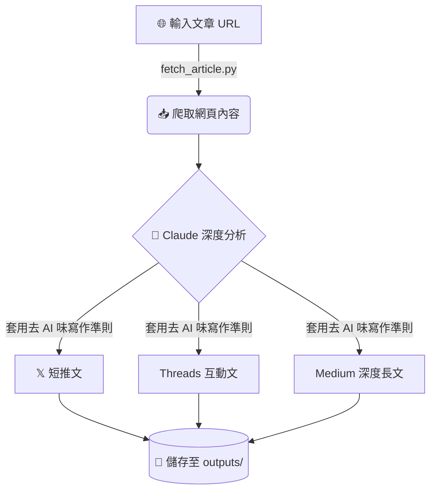

<div align="center">


# ✍️ write-posts

**一鍵將任何文章網址，轉化為三個平台的專屬社群貼文。**

[](https://claude.ai/code)
[](https://opensource.org/licenses/MIT)

</div>

---

## ✨ 核心功能 (What It Does)

只需貼上文章網址，Claude 即會自動抓取內容、深度閱讀，並為您產出以下三種格式：

| 平台            | 長度限制     | 風格定位                               |
| :-------------- | :----------- | :------------------------------------- |
| **𝕏 (Twitter)** | ≤ 140 字     | 犀利、有觀點、單一核心洞察             |
| **🧵 Threads**  | 400–600 字   | 故事性敘述、對話感、以問句結尾引發共鳴 |
| **📝 Medium**   | 1500–3000 字 | 深度分析、結構化 Markdown 長文         |

> 💡 **內建高品質寫作準則**：所有產出皆採用繁體中文，並透過嚴格的 Prompt 限制消除「AI 機器感」（禁用生硬轉折詞、要求長短句交錯等）。

---

## 🔄 運作流程 (How It Works)



---

## 🚀 快速開始 (Quick Start)

### 1. 安裝套件 (Dependencies)

```bash
pip install requests beautifulsoup4 lxml
```

### 2. 安裝 Skill (Install)

將 `.claude/` 資料夾複製到您的 Claude Code 專案根目錄：

```text
your-project/
├── .claude/
│   └── skills/
│       └── write-posts/
│           └── SKILL.md
├── skills/
│   └── write-posts/
│       ├── scripts/
│       │   └── fetch_article.py
│       └── prompts/
│           └── write-posts.prompt
```

### 3. 執行 (Run)

```bash
/write-posts https://example.com/some-article
```

---

## 📂 輸出結構 (Output)

執行完成後，檔案會自動依照時間戳記整理儲存：

```text
outputs/posts/20260221_143022/
├── article_source.json   ← 原始抓取的文章資料 (JSON)
├── x_post.md             ← 𝕏 推文草稿
├── threads_post.md       ← Threads 貼文草稿
└── medium_article.md     ← Medium 長文草稿
```

---

## 🖋️ 寫作品質保證 (Writing Quality)

我們在 `write-posts.prompt` 中定義了極其嚴格的「去 AI 味」寫作規範：

- **⚡ 句式靈動**：長短句交替，打破死板結構。
- **🚫 拒絕機械轉折**：禁用「首先 / 其次 / 最後 / 總之」等陳腔濫調。
- **👁️ 展示而非說教**：用具體細節取代抽象總結 (Show, don't tell)。
- **🛑 禁用黑名單**：嚴格封鎖「值得注意的是」、「綜合上述」等常見 AI 用語。
- **🎯 平台適配自檢**：
  - **𝕏**: 拿掉 hashtag，這句話本身能引發回覆嗎？
  - **Threads**: 刪掉這段，讀者會發現少東西嗎？
  - **Medium**: 每個小標題能獨立當成推文發布嗎？

---

## 📋 系統需求 (Requirements)

- **Python 3.10+** (執行爬蟲腳本)
- **Claude Code** (AI 撰寫與流程調度)
- **requests**, **beautifulsoup4**, **lxml** (網頁解析)

> 🔐 **無需額外 API Keys**：所有的文章分析與內容生成均由 Claude Code 直接在本地環境中驅動完成。

---

<div align="center">
  <small>📝 License: MIT | Crafted for <a href="https://claude.ai/code">Claude Code</a></small>
</div>
